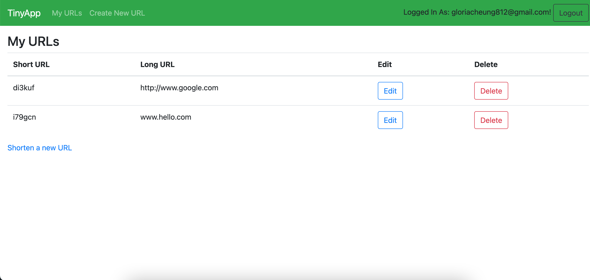
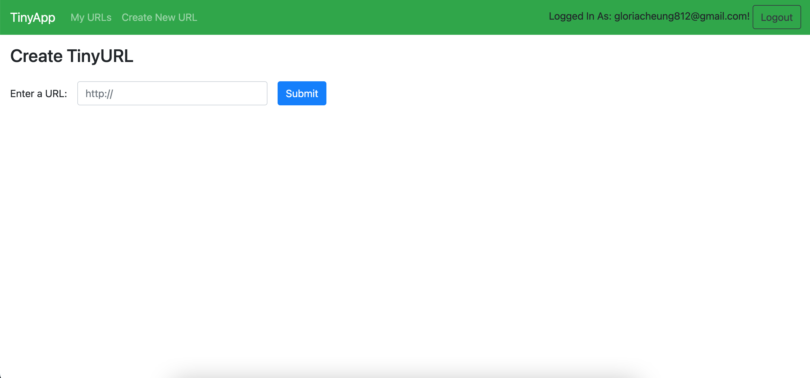

# TinyApp Project

TinyApp is a full stack web application built with Node and Express that allows users to shorten long URLs (à la bit.ly).

## Final Product

URL homepage when logged in:

Create New URL:

## Dependencies

- Node.js
- Express
- EJS
- bcrypt
- body-parser
- cookie-session

## Getting Started

- Install all dependencies (using the `npm install` command).
- Run the development web server using the `node express_server.js` command.
- If using nodemon, run web server using `npm start` command.

## Connect With Me

[Github](https://github.com/gloria-cheung)
-- [Linkedin](http://www.linkedin.com/in/gloria-cheung) --
[Portfolio](http://www.gloria-cheung.com)
